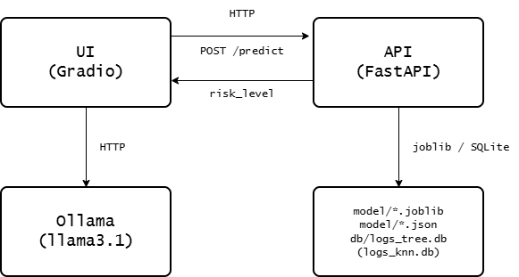

# Documentación Técnica 

## Objetivo del proyecto

Sistema de evaluación de riesgo crediticio compuesto por dos partes independientes:

- Un **agente conversacional** (LLM local vía Ollama y LangChain) que recolecta en español los 15 datos de una solicitud de crédito.
- Una **API de predicción** (FastAPI y scikit-learn) que, con esos 15 datos ya completos, calcula el nivel de riesgo (alto / medio / bajo) con un árbol de decisión entrenado sobre un dataset real.

El chat nunca calcula el riesgo por sí mismo solo conversa, extrae datos, pide confirmación, y delega el cálculo real a la API.

## Arquitectura

<picture>
    <source media="(prefers-color-scheme: dark)" srcset="assets/dark_diagram.png">
    <source media="(prefers-color-scheme: light)" srcset="assets/light_diagram.png">
    
</picture>

- **UI** y **API** son procesos independientes, pensados para dockerizarse por separado. La UI se comunica con la API únicamente por HTTP (`ApiPredictionClient`Z.
- La **API** no depende de Gradio ni de LangChain; solo de FastAPI, scikit-learn y SQLAlchemy.

## Estructura del proyecto

```
Proyecto/
├── pyproject.toml           # dependencias divididas en extras [api] / [ui]
├── docker-compose.yml
├── docker/
│   ├── api.Dockerfile
│   ├── ui.Dockerfile
│   ├── ollama.Dockerfile
│   └── ollama-entrypoint.sh # baja llama3.1 automáticamente al arrancar
├── dataset/credit_risk_train.csv
├── model/                   # artefactos generados (modelo, encoder, métricas)
├── db/                      # bitácora de predicciones (SQLite)
└── src/credio/
    ├── constants.py         # rutas, URLs (configurables por env var), labels
    ├── schemas/             # PredictionRequest, CollectedData, ConfirmationIntent
    ├── dtos/                # modelos SQLAlchemy de la bitácora (Log_Tree, Log_KNN)
    ├── models/               # scripts de entrenamiento (build_knn.py, build_tree.py)
    ├── api/
    │   ├── routes.py         # POST /predict, GET /  (métricas)
    │   └── main.py           # entrypoint: uvicorn
    ├── llm/
    │   ├── prompts.py         # todos los prompts del sistema
    │   ├── llm_client.py      # factory de ChatOllama
    │   └── extractor.py       # DataExtractor, ConfirmationExtractor
    ├── services/
    │   ├── chat.py            # CreditRiskChatService (orquestador del chat)
    │   ├── prediction_client.py  # cliente HTTP hacia la API (usa la UI)
    │   ├── prediction_models.py  # DecisionTreeService / KNNService (usa la API)
    │   └── log.py             # LogService (bitácora SQLite)
    └── ui/
        ├── interface.py        # gr.ChatInterface
        └── main.py             # entrypoint: demo.launch()
```

## Flujo del chat (`CreditRiskChatService`)

1. **`send(mensaje)`**: si hay una confirmación pendiente, la resuelve (ver paso 4). Si no, agrega el mensaje al historial y llama a `_update_collected_data()`.
2. **`_update_collected_data()`**: usa `DataExtractor` (LLM en modo salida estructurada sobre `CollectedData`) para releer toda la conversación y actualizar los campos ya detectados. Permite corregir un dato ya dado, no solo llenar los vacíos.
3. Si `missing_fields()` no está vacío, el LLM principal genera una respuesta pidiendo lo que falta (usando `SYSTEM_PROMPT` y `LAST_USER_MESSAGE`, que le recuerda explícitamente no evaluar mientras falten datos).
4. Si ya no falta nada, `_ask_confirmation()` arma el resumen **directo en código Python** y espera un sí/no.
5. La respuesta del usuario se clasifica con `ConfirmationExtractor` (LLM en modo estructurado sobre `ConfirmationIntent`). Si confirma, se llama `_run_prediction()`; si rechaza, se le pide la corrección (que se aplicará en el siguiente `_update_collected_data()`).
6. **`_run_prediction()`** arma un `PredictionRequest`, llama al `PredictionClient` inyectado, y pasa el resultado a `_generate_recommendation()`.
7. **`_generate_recommendation()`** le pide al LLM (con `RECOMMENDATION_SYSTEM_PROMPT`, que lo delimita para que solo redacte texto y no tome decisiones) que redacte el mensaje final según la política de riesgo, y reinicia la sesión.

> **Nota de diseño:** el mensaje de confirmación (paso 4) se construye sin LLM a propósito, porque pidiendole al modelo que resuma pero no evalúe a veces terminaba generando una evaluación de riesgo inventada, violando la regla de planteada. Construirlo en código elimina ese riesgo por completo.

## API (`POST /predict`)

Recibe un `PredictionRequest` con los 15 campos, codifica las variables categóricas con los mapas guardados en `model/encoder.json`, llama al árbol de decisión, registra el resultado en `db/logs_tree.db` y devuelve:

```json
{ "risk_level": "alto" | "medio" | "bajo" }
```

`GET /` devuelve las métricas del modelo cargado (`depth`, `f1_score`, `accuracy_score`).

### Los 15 campos (`PredictionRequest`)

`annual_income`, `monthly_inhand_salary`, `credit_history_age`, `total_emi_per_month`, `interest_rate`, `num_of_loan`, `delay_from_due_date`, `num_credit_inquiries`, `credit_mix` (Good/Standard/Bad), `outstanding_debt`, `credit_utilization_ratio`, `payment_of_min_amount` (Yes/No), `monthly_balance`, `spend_level` (Low/High), `value_level` (Small/Medium/Large).

**Importante**: el orden de las 15 features en `input_data` (routes.py) debe coincidir exactamente con el orden de columnas usado al entrenar (`models/build_tree.py`). Si se agrega o quita un campo del schema, hay que actualizar ambos lados y volver a entrenar el modelo (borrar `model/*.joblib`, `model/encoder.json`, `model/metrics.json` para forzar reentrenamiento en el próximo arranque).

## Manejo de excepciones (`POST /predict`)

El endpoint distingue tres tipos de fallo, cada uno con un tratamiento distinto:

| Situación | Qué pasa | Código HTTP |
|---|---|---|
| Un campo tiene un tipo o valor fuera del `Literal` esperado (ej. `credit_mix: "Excellent"`) | Pydantic/FastAPI lo rechaza automáticamente antes de ejecutar el endpoint | `422` (automático) |
| Un campo numérico recibe un valor negativo donde no corresponde (todos excepto `delay_from_due_date`, que sí puede ser negativo) | `Field(ge=0)` en `PredictionRequest`/`CollectedData` lo rechaza automáticamente | `422` (automático) |
| Un valor es válido según el schema pero no está en `model/encoder.json` (desajuste entre el schema y lo que se entrenó) | `_encode()` lo detecta explícitamente y lanza un error con el campo y el valor problemático | `422` |
| Falla el cálculo del riesgo por cualquier otro motivo (modelo no cargado, error interno de scikit-learn, etc.) | Se captura en el primer `try/except` y se responde con un mensaje descriptivo | `500` |
| Falla el guardado en la bitácora (`db/logs_tree.db`) | Se captura en un `try/except` **separado**, solo del lado del guardado; el error se registra con `logger.exception(...)` pero no se propaga | No aplica, la respuesta sigue siendo `200` con el `risk_level` ya calculado |

La razón de separar el guardado en la bitácora del resto: es un detalle de auditoría interno, no algo que dependa de quien llama al endpoint ni algo que el cliente pueda corregir. Que falle no debería impedir que el usuario reciba el resultado de una predicción que sí se calculó correctamente. El error queda disponible en los logs del contenedor (`docker compose logs -f api`) para que se pueda diagnosticar aparte.

## Modelo predictivo

- Entrenado en `models/build_tree.py` sobre `dataset/credit_risk_train.csv`.
- Limpieza: nulos rellenados (media/moda), outliers (z-score > 3) excluidos del entrenamiento.
- Codificación: `credit_mix`, `spend_level`, `value_level` con mapas ordinales fijos; `payment_of_min_amount` con `OrdinalEncoder`. Los mapas se guardan en `model/encoder.json` y deben usarse igual en `routes.py` al predecir.
- Búsqueda de la mejor profundidad (`max_depth` entre 3 y 99, salto de 2) por f1-score ponderado.

## Variables de entorno

| Variable                   | Usada por                | Default                  | Cuándo cambiarla                                                                                           |
| -------------------------- | ------------------------ | ------------------------ | ---------------------------------------------------------------------------------------------------------- |
| `API_BASE_URL`             | UI                       | `http://127.0.0.1:8000`  | En docker-compose se fija a `http://api:8000` (nombre del servicio)                                        |
| `OLLAMA_BASE_URL`          | UI                       | `http://localhost:11434` | En docker-compose: `http://ollama:11434`, o `http://host.docker.internal:11434` si Ollama corre en el host |
| `OLLAMA_MODEL`             | UI, contenedor de Ollama | `llama3.1`               | Si se quiere usar otro modelo                                                                              |
| `OLLAMA_MODEL_TEMPERATURE` | UI                       | `0.2`                    | Ajustar creatividad del LLM principal                                                                      |
| `API_HOST` / `API_PORT`    | API                      | `0.0.0.0` / `8000`       | Cambiar el puerto de la API                                                                                |
| `UI_HOST` / `UI_PORT`      | UI                       | `0.0.0.0` / `7860`       | Cambiar el puerto de la UI                                                                                 |

Todas tienen valores por defecto que funcionan directamente tanto en local como en Docker; solo hace falta declararlas cuando su valor correcto depende del entorno (por eso `API_BASE_URL`/`OLLAMA_BASE_URL` sí están en `docker-compose.yml` y las demás no).

## Cómo ejecutarlo

### Clonar el repositorio

```bash
git clone git@github.com:ADavidAR/credit-application-agent.git
cd credit-application-agent
```

### En local (sin Docker)

Requiere [Ollama](https://ollama.com) en ejecución con el modelo descargado (`ollama pull llama3.1`).

```bash
pip install -e ".[api]"
pip install -e ".[ui]"

# Terminal 1
python -m credio.api.main      # http://localhost:8000

# Terminal 2
python -m credio.ui.main       # http://localhost:7860
```

### Con Docker

Requiere Docker Desktop en ejecución.

```bash
docker compose up --build
```

Esto levanta 3 servicios: `api` (puerto 8000), `ui` (puerto 7860) y `ollama` (puerto 11434, descarga `llama3.1` automáticamente la primera vez que arranca). La UI se conecta a los otros dos por nombre de servicio (DNS interno de Docker Compose), no por `localhost`.

- Los volúmenes `./model`, `./db` y `./dataset` se montan en el contenedor de la API para persistir el modelo entrenado y la bitácora entre reinicios.
- Si Ollama ya está en ejecución en la máquina local (no en Docker), se debe comentar el servicio `ollama` y cambiar `OLLAMA_BASE_URL` en `docker-compose.yml` a `http://host.docker.internal:11434`.

## Bitácora de predicciones

Cada llamada exitosa a `/predict` se registra en `db/logs_tree.db` (tabla `Logs`, definida en `dtos/dto.py` como `Log_Tree`) con los datos de entrada, la clase predicha y la fecha. Sirve para auditar el comportamiento del modelo en producción.
